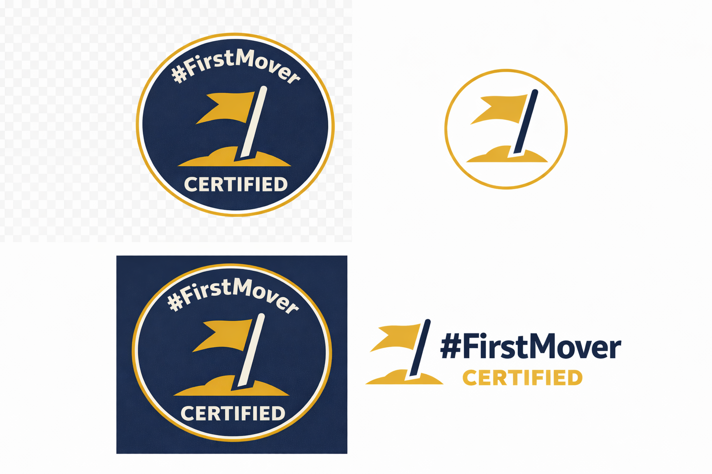

# Certified Badge Assets

The preview image shows what the #FirstMover Certified badge looks like across all 4 variants (seal, minimal, dark, lockup).

**Full-resolution individual assets are delivered privately upon certification approval.**

The certified badge is distinguished from the open badge by:
- A gold outer ring around the seal
- "CERTIFIED" text on the bottom perimeter
- Gold circle border on the minimal variant

To get certified: see [CERTIFIED.md](../../CERTIFIED.md) for the application process.

